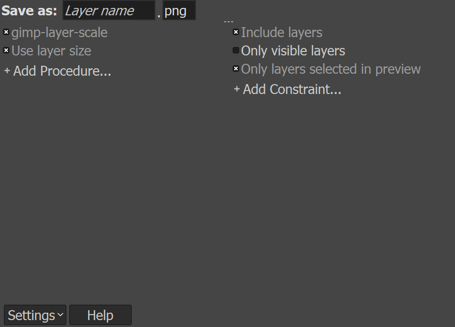

# DoggoFace
## This is Geir's dog:

## These are some random doggos:

## Drawings
We're using [Gimp](https://www.gimp.org/) to draw the different face features, and [this plugin for Gimp](https://github.com/khalim19/gimp-plugin-export-layers) to make it easier to export the layers as images, as well as setting the image size. Feel free to add your own features!

### Drawing Guidelines
All features should work with all instances of the different features, and should be drawn using the brush "2. Hardness 100", with size 51. The canvas is 2048 x 2048 px in size.

### Exporting the layers
After installing the plugin mentioned previously, open Gimp and go to "File>Export layers...". In the pop-up window, press "Settings>Show More Settings". Press "Add Procedure..." and "Add Constraint..." to set up the settings like this:

After adding the procedure gimp_layer_scale, a pop-up will prompt you to set a new width and height. What you decide here will be the size of the final image. This can be changed later, should you wish to change the size. The features in the Doggoparts-folder are 1024x1024, but you are free to change the size according to your needs. Just remember that you have to export all the layers, and overwrite the files, if you wish to use a different size than 1024 x 1024.

The recommended constraint-settings will enable you to avoid having to overwrite feature-files that you don't wish to change, but are not strictly necessary.

## Example Doggos

### This is Geir's dog:

### These are some random doggos:

