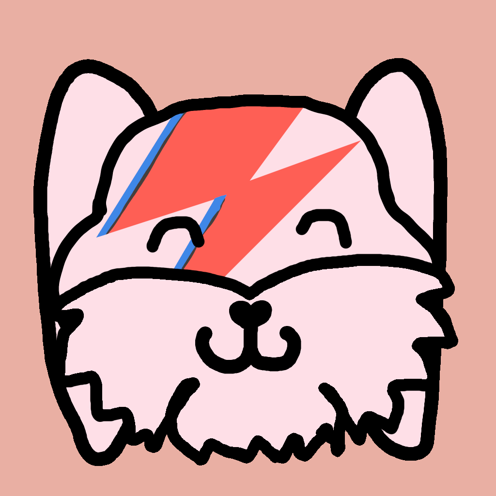
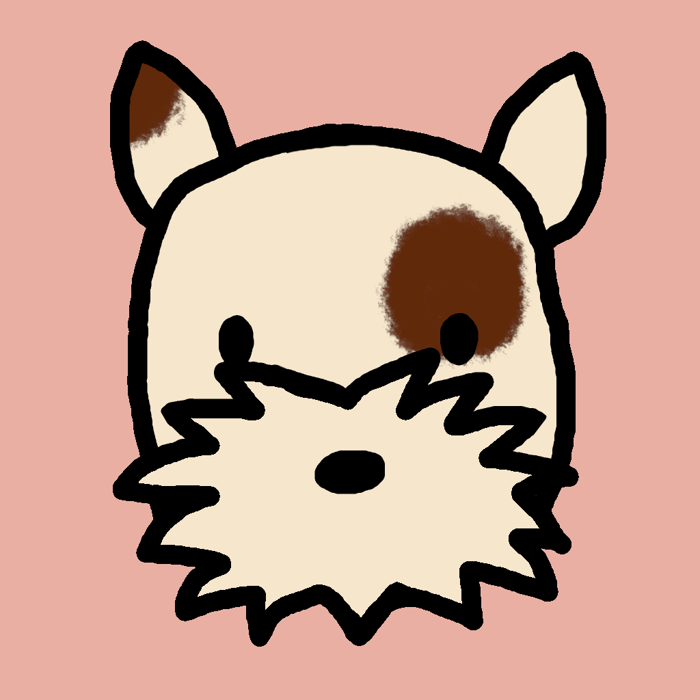
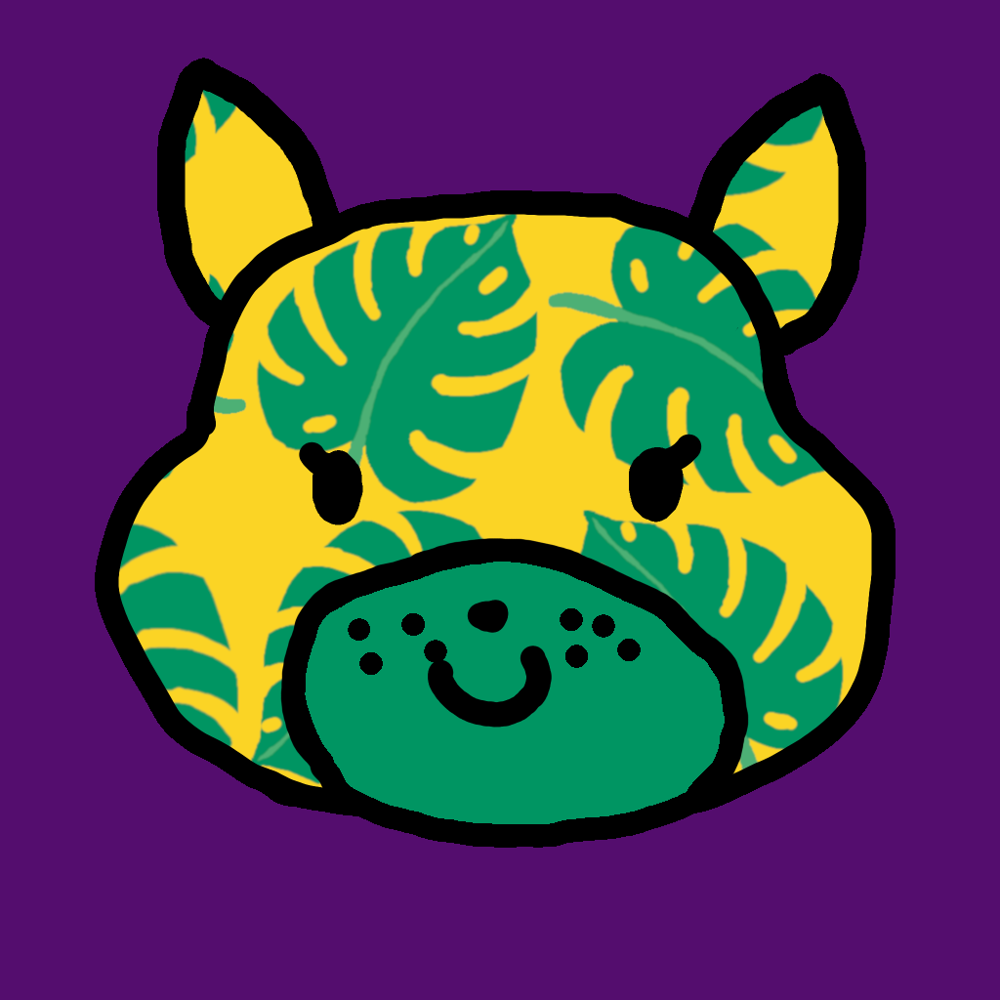
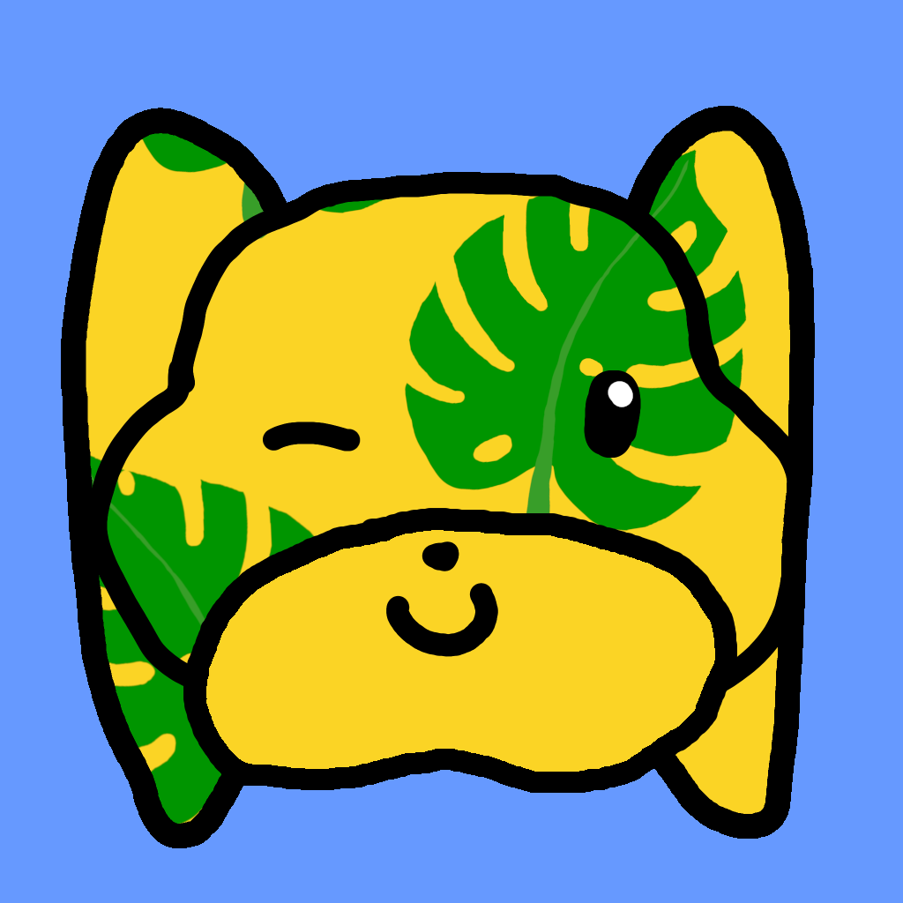
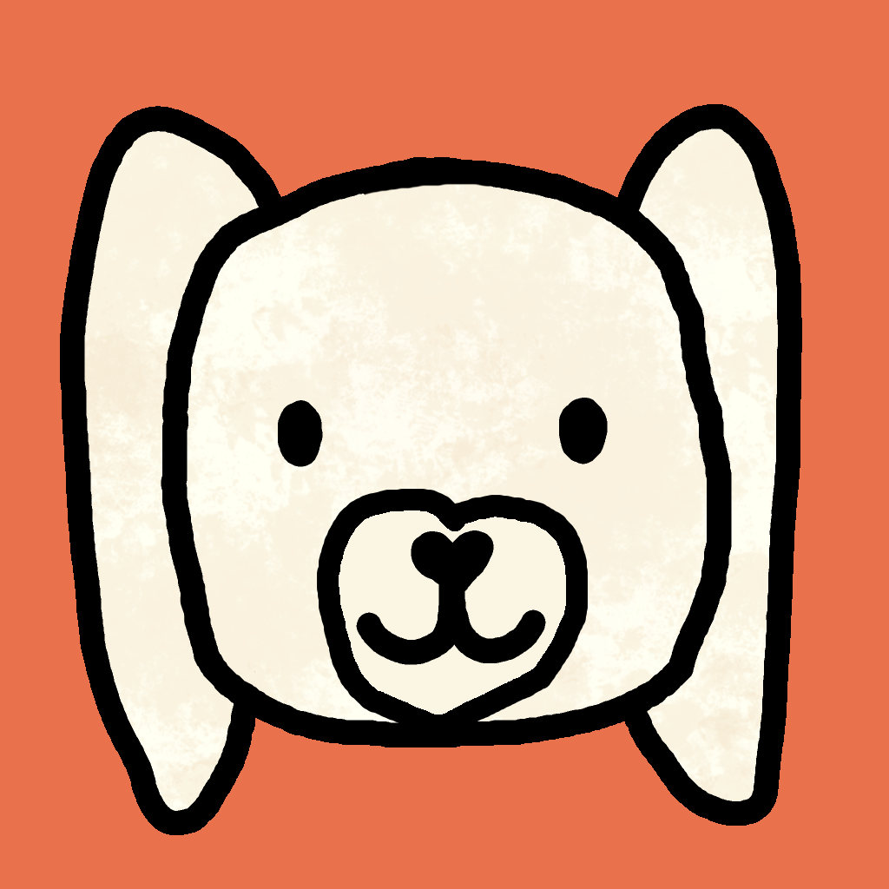

# DoggoFace

## Drawings
We're using https://github.com/khalim19/gimp-plugin-export-layers and Gimp to draw the different face features. Feel free to add your own!

### Rules
All features should work with all instances of the different features, and should be drawn using the brush "2. Hardness 100", with size 51

## This is Geir's dog:

## These are some random doggos:

